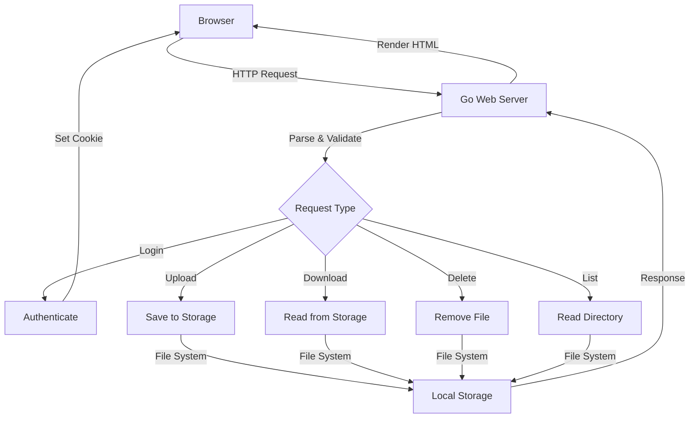
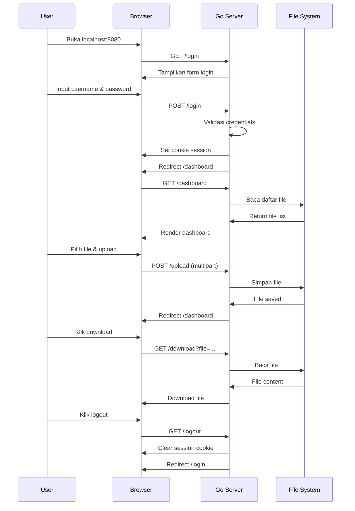

<div align="center">

# Go-NAS  
### Network Attached Storage Sederhana


Aplikasi **Network Attached Storage (NAS)** sederhana yang dibuat dengan Go,  
dirancang untuk pembelajaran dan penggunaan pribadi di perangkat lokal  
seperti PC, Mini PC, atau Raspberry Pi.

</div>

## 🎯 Fitur Utama

- ✅ **Web Interface Lokal**: Akses melalui browser di jaringan lokal
- ✅ **Autentikasi Login**: Session berbasis cookie yang aman
- ✅ **Upload File**: Upload file dengan ukuran hingga 100MB
- ✅ **Download File**: Download file dengan satu klik
- ✅ **Manajemen File**: Lihat daftar file dan hapus file yang tidak perlu
- ✅ **Responsive Design**: Interface yang ramah di perangkat mobile dan desktop
- ✅ **Lightweight**: Hanya butuh Go Runtime, tanpa dependency eksternal

## 🛠️ Tech Stack

| Komponen | Teknologi |
|----------|-----------|
| Backend | Go (net/http) |
| Frontend | HTML5, CSS3 |
| Storage | Local File System |
| Session | Cookie dengan Hash SHA256 |
| Templating | Go text/template |

## 📦 Instalasi

### Prerequisites
- **Go 1.21+** ([Download](https://go.dev/dl))
- Terminal/Command Prompt
- Minimal 100MB disk space untuk storage

### Langkah-Langkah

1. **Clone atau download project**
   ```bash
   git clone https://github.com/ficrammanifur/Go-NAS
   cd go-nas
   ```

2. **Jalankan aplikasi**
   ```bash
   go run main.go
   ```

3. **Akses aplikasi**
   - Buka browser: `http://localhost:8080`
   - Credentials default:
     - **Username**: `admin`
     - **Password**: `admin123`

## 🚀 Cara Penggunaan

### Login
1. Akses `http://localhost:8080` di browser
2. Masukkan username dan password
3. Klik tombol "Login"

### Upload File
1. Setelah login, akan tampil halaman Dashboard
2. Klik area "Pilih file atau drag & drop"
3. Pilih file dari komputer atau drag & drop
4. Klik tombol "Upload"

### Download File
1. Di bagian "Daftar File", cari file yang ingin didownload
2. Klik tombol "Download" pada baris file
3. File akan didownload ke folder Download Anda

### Hapus File
1. Di bagian "Daftar File", pilih file yang ingin dihapus
2. Klik tombol "Hapus"
3. Konfirmasi penghapusan

## 📊 Diagram Sistem

### Architecture Diagram



### System Workflow Diagram



## 📁 Struktur Project

```
go-nas/
├── main.go                 # File utama aplikasi
├── go.mod                  # Go module definition
├── README.md              # Dokumentasi ini
├── storage/
│   └── files/             # Folder penyimpanan file (dibuat otomatis)
├── templates/
│   ├── login.html         # Template halaman login
│   └── dashboard.html     # Template halaman dashboard
└── static/
    └── style.css          # Stylesheet aplikasi
```

## 🔒 Keamanan

**⚠️ CATATAN PENTING**: Project ini adalah untuk pembelajaran dan penggunaan lokal. Berikut limitasinya:

- ❌ Password disimpan secara plaintext (hanya untuk demo)
- ❌ Tidak ada enkripsi data di transit
- ❌ Tidak ada permission per file
- ❌ Tidak cocok untuk production atau data sensitive

**Untuk production**, tambahkan:
- Enkripsi TLS/HTTPS
- Password hashing dengan bcrypt
- Rate limiting
- Access control per user
- Audit logging

## 🔧 Konfigurasi

Edit `main.go` untuk mengubah:

```go
const (
    storageDir  = "./storage/files"    // Lokasi penyimpanan file
    username    = "admin"              // Username login
    password    = "admin123"           // Password login
    sessionName = "gnas_session"       // Nama cookie session
)
```

## 🛣️ Roadmap

### v0.1 - Basic NAS ✅
- [x] Web interface login
- [x] Upload file
- [x] Download file
- [x] Delete file
- [x] File listing
- [x] Responsive design

### v0.2 - Multi User (Planned)
- [ ] User management
- [ ] Per-user storage quota
- [ ] User-specific files
- [ ] Admin panel

### v0.3 - Advanced Features (Planned)
- [ ] WebDAV support
- [ ] File search
- [ ] File compression
- [ ] Cloud backup integration

### v1.0 - Production Ready (Future)
- [ ] HTTPS/TLS
- [ ] User authentication dengan database
- [ ] File versioning
- [ ] Permission management
- [ ] Audit logging

## 📝 License

MIT License - Project ini bebas digunakan untuk pembelajaran dan pengembangan pribadi.

## 🤝 Kontribusi

Kontribusi sangat diterima! Silakan:
1. Fork repository ini
2. Buat branch fitur (`git checkout -b feature/AmazingFeature`)
3. Commit changes (`git commit -m 'Add AmazingFeature'`)
4. Push ke branch (`git push origin feature/AmazingFeature`)
5. Buat Pull Request

## ⚙️ Troubleshooting

### Error: "Port 8080 already in use"
Ubah port di `main.go`:
```go
http.ListenAndServe(":8081", nil)  // Ganti dengan port lain
```

### File tidak bisa diupload
- Pastikan folder `storage/files` memiliki permission write
- Ukuran file tidak melebihi 100MB
- Jalankan dengan permission yang cukup

### Tidak bisa akses dari perangkat lain
- Firewall mungkin memblokir port 8080
- Ganti bind address di `main.go`:
```go
http.ListenAndServe("0.0.0.0:8080", nil)
```

## 📚 Referensi

- [Go net/http Documentation](https://golang.org/pkg/net/http/)
- [Go text/template Documentation](https://golang.org/pkg/text/template/)
- [HTTP Cookies RFC 6265](https://tools.ietf.org/html/rfc6265)

## 👨‍💻 Author

Go-NAS dibuat sebagai project pembelajaran untuk demonstrasi Go web development.

---

**Selamat belajar dan semoga project ini membantu perjalanan Anda dalam Go programming!** 🚀
